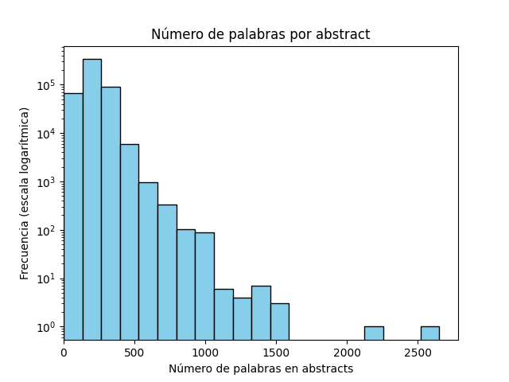

<h1 align="center">MedChat – Medical Domain Chatbot</h1>

### Descripción General
MedChat es un chatbot especializado en el dominio médico, capaz de responder a preguntas generales sobre salud y asistir con diagnósticos médicos a través de conversación en lenguaje natural. Este proyecto utiliza un enfoque de RAG, *Retrieval-Augmented Generation*, para especializar (*grounding*) un LLM con un extenso corpus externo de literatura médica, con el objetivo de reducir alucinaciones y mejorar la precisión factual de las respuestas. El sistema recupera información relevante de una base de conocimiento médica (millones de abstracts de PubMed) y la proporciona como contexto al modelo de lenguaje, el modelo aprovecha este contexto para generar una respuesta más adecuada. Todo el desarrollo y la experimentación se realizaron en Kaggle Notebooks, lo que impuso restricciones en los recursos computacionales y el tamaño de los modelos; debido a ello se utilizó un modelo de lenguaje más pequeño de 7B parámetros, además tuvo que ser cuantizado.

### Arquitectura
La arquitectura de MedChat sigue un pipeline que combina la recuperación de información con la generación de texto. Consta de tres etapas principales: Indexación, Recuperación y Generación. Cuando el usuario realiza una pregunta, el sistema primero convierte la consulta en una representación vectorial (*embedding*) y la utiliza para recuperar los documentos más relevantes (resúmenes médicos) del corpus indexado. Estos textos recuperados luego se suministran al modelo de lenguaje junto con la pregunta original, permitiendo que el modelo fundamente su respuesta en el contexto proporcionado. Finalmente, el modelo genera una respuesta que intenta resolver la consulta del usuario utilizando la información médica actualizada proveniente de los documentos recuperados.

### Conjunto de Datos
La base de conocimiento de MedChat se construyó a partir de un gran conjunto de resúmenes de artículos de PubMed. Se utilizó un corpus de aproximadamente 4,6 millones de resúmenes de publicaciones médicas (pares de título y resumen) como fuente de conocimiento del dominio. Debido a las limitaciones del entorno Kaggle, se empleó un subconjunto de 500.000 resúmenes. Cada resumen (con su título como metadato) funciona como un documento independiente en el corpus de recuperación. Al indexar a nivel de resumen, preservamos fragmentos coherentes de información que probablemente respondan por completo a preguntas médicas específicas.

 *Distribución de la longitud de los resúmenes (número de palabras por resumen) en escala logarítmica de frecuencia.* La mayoría de los resúmenes del corpus tienen unas pocas centenas de palabras (típicamente 100–300 palabras), con una cola larga de resúmenes más extensos de hasta ~2500 palabras. Esta distribución motivó la decisión de utilizar resúmenes completos como unidades recuperables (chunks) — la gran mayoría encaja cómodamente dentro de la ventana de contexto de nuestros modelos. En la práctica, se estableció un límite de ~2.500 tokens por fragmento para asegurar que incluso los resúmenes más largos pudieran ser procesados. El extenso dataset de PubMed proporciona una amplia cobertura de temas médicos, lo cual es crucial para que el chatbot pueda responder a preguntas diversas.

### Detalles de Implementación
**Embeddings y Almacenamiento Vectorial:** Para habilitar la búsqueda semántica, utilizamos un modelo de *embeddings* bilingüe (`jinaai/jina-embeddings-v2-base-es`) para codificar tanto las consultas de usuario como los documentos en vectores de alta dimensión. Este modelo (137M parámetros) soporta español e inglés, lo que permite a MedChat entender preguntas en cualquiera de estos idiomas y mapearlas al mismo espacio vectorial que los abstracts (principalmente en inglés). También admite textos de entrada largos (hasta 8192 tokens), lo cual es esencial para manejar abstracts médicos extensos. Las representaciones vectoriales de todos los documentos fueron indexadas usando FAISS (Facebook AI Similarity Search), una biblioteca eficiente para búsqueda de similitud de vectores a gran escala. FAISS permite realizar búsquedas de vecinos más cercanos de forma muy rápida, de modo que dada la *embedding* de una nueva consulta, el sistema puede obtener los abstracts más relevantes entre cientos de miles en unos pocos milisegundos.

**Modelo de Lenguaje:** Para la generación, empleamos el Mistral-7B-Instruct-v0.2 como LLM, un modelo de 7 mil millones de parámetros afinado para seguir instrucciones. Este modelo fue elegido por su equilibrio entre capacidad y tamaño, ya que modelos más grandes no eran factibles de ejecutar en el entorno de Kaggle. Es notable que ofrece una ventana de contexto amplia (hasta 32k tokens), lo cual es ventajoso para acomodar el contexto recuperado. Ejecutamos el modelo en modo cuantizado (precisión de 4 bits) para ajustarlo a los límites de memoria de la GPU en Kaggle, utilizando herramientas como BitsAndBytes para carga en 4-bit. A pesar de su tamaño relativamente pequeño, Mistral-7B pudo aprovechar el conocimiento inyectado mediante la recuperación para generar respuestas más precisas y detalladas.

**Orquestación con LangChain:** La tubería RAG se implementó con la ayuda del framework LangChain, que simplifica la construcción de IA conversacional con memoria y recuperación. Configuramos una ConversationalRetrievalChain que integra el modelo de *embeddings*, el almacén vectorial FAISS (como *retriever*) y el LLM generativo. Esta cadena también mantiene una memoria de conversación del historial del diálogo, lo que permite que el chatbot maneje conversaciones de múltiples turnos. Cuando el usuario hace una pregunta de seguimiento, el sistema puede generar una pregunta reformulada de manera independiente (considerando el historial de la conversación) antes de efectuar la recuperación – asegurando que se obtenga contexto relevante incluso si la consulta del usuario es implícita o hace referencia a algo previo. El prompt enviado al modelo de lenguaje consiste en la pregunta del usuario (posiblemente reformulada) más el contenido de los abstracts recuperados, formateados apropiadamente. Luego el LLM produce una respuesta en estilo conversacional. También incorporamos técnicas de ingeniería de *prompts* (p. ej., instrucciones de sistema) para animar al modelo a brindar información médica útil y precisa (y evitar contenido no seguro o diagnósticos inapropiados).

**Entorno de Desarrollo:** Todos los experimentos (procesamiento de datos, indexación, inferencia del modelo, etc.) se llevaron a cabo en cuadernos de Kaggle. Los artefactos intermedios, como el índice vectorial FAISS y los conjuntos de datos preparados (por ejemplo, el subconjunto filtrado de PubMed y los conjuntos de preguntas para evaluación), se almacenaron en el entorno de Kaggle. El cuaderno de desarrollo principal de este proyecto está disponible en Kaggle (ver la sección de [Enlaces](#enlaces)), el cual incluye el código para la ingesta de datos, configuración del modelo, definición de la cadena conversacional y rutinas de evaluación.

### Evaluación
Para evaluar el desempeño del chatbot en un contexto de preguntas y respuestas médicas, lo probamos con MedMCQA – un amplio dataset de preguntas de opción múltiple del dominio médico ([MedMCQA: A Large-scale Multi-Subject Multi-Choice Dataset for Medical domain Question Answering](https://proceedings.mlr.press/v174/pal22a.html#:~:text=)). Nos centramos en el conjunto de validación (~4.000 preguntas, reducidas a ~2.000 tras eliminar las preguntas con más de una respuesta correcta). Cada pregunta viene con cuatro opciones de respuesta (a, b, c, d), y se le indicó al chatbot que seleccionara la opción más apropiada. Para lograr que el LLM eligiera entre las opciones dadas, empleamos un prompt estructurado con un formato fijo: se mostraba la pregunta y sus opciones, seguido de una instrucción que indicaba responder en formato JSON solo con la opción elegida (por ejemplo, `{"answer": "b"}`). Esto aseguró que la salida pudiera ser analizada automáticamente para determinar la respuesta seleccionada.

Realizamos dos ejecuciones de prueba: una con solo el LLM (sin RAG) y otra con la configuración RAG completa (LLM con RAG). El modelo Mistral-7B por sí solo alcanzó una precisión de ~14,06%, lo cual es desastroso, pues es peor que adivinar al azar (25% con cuatro opciones) . Con RAG, utilizando los abstracts de PubMed recuperados como contexto, la precisión aumentó a ~18,29%. Esta mejora relativa de ~30% demuestra que suministrar conocimiento relevante ayuda al modelo a tomar decisiones más acertadas. Sin embargo, los accuracies generales siguieron siendo bajos, lo que refleja la dificultad del conjunto MedMCQA y las limitaciones de usar un modelo de 7B sin fine-tunning para un desafío tan complejo. En muchos casos, el modelo no escogió con confianza una opción (o prefirió no responder dada la incertidumbre), lo cual se consideró incorrecto. Como referencia, incluso los modelos de mejor rendimiento en la competencia MedMCQA (que son órdenes de magnitud más grandes y usualmente afinados en esta tarea) alcanzan solo alrededor de 55–60% de precisión. Teniendo en cuenta que nuestro chatbot no fue entrenado específicamente en este dataset (no se realizó *fine-tuning* ni tuvo exposición a las preguntas de entrenamiento), el rendimiento con RAG, si bien bajo en términos absolutos, demuestra que la recuperación de información puede inyectar conocimiento útil para mejorar la capacidad de respuesta en preguntas médicas en escenario *zero-shot*.

Cabe señalar que evaluar el desempeño del chatbot en conversaciones libres es más subjetivo. No existe una única respuesta "correcta" para preguntas abiertas de los usuarios, lo cual dificulta una evaluación automática. Como alternativa, registramos conversaciones de ejemplo y las inspeccionamos manualmente para verificar su coherencia y exactitud. Estas transcripciones demostraron que MedChat puede proporcionar información relevante a las consultas de los usuarios al apoyarse en hechos recuperados de la literatura. También revelaron algunos modos de falla, por ejemplo, que el bot ocasionalmente confunde los síntomas del usuario con detalles de los artículos recuperados – lo que indica un área de mejora en cuanto a cómo el modelo distingue el contexto del usuario del contexto de referencia.

### Ejemplos de Uso
Durante el desarrollo, se desplegó una pequeña interfaz web de demostración (vía GitHub Pages) para mostrar el chatbot en acción y recopilar interacciones de ejemplo. Los usuarios podían hacer preguntas a través de esta interfaz (con el backend ejecutándose en el entorno de Kaggle), y las transcripciones de la conversación se guardaban para análisis. Por ejemplo, en una interacción un usuario preguntó *“¿Cuáles son las posibles causas de una tos persistente?”* y MedChat respondió con una lista de causas potenciales (p. ej. resfriado común, asma, reflujo gastroesofágico) junto con breves explicaciones extraídas de artículos médicos. En otro ejemplo, ante una consulta en español – *“¿Qué significa tener glucosa alta en sangre?”* – el sistema la comprendió; recuperó información sobre la hiperglucemia del corpus y respondió (en inglés) explicando que un nivel alto de glucosa en sangre puede indicar afecciones como la diabetes u otros trastornos metabólicos. Estos ejemplos ilustraron la capacidad del sistema para manejar preguntas en distintos idiomas y brindar respuestas pertinentes apoyándose en el enfoque RAG.

*(El sitio de demostración **josubarru.github.io** está actualmente inactivo, pero las conversaciones registradas de esas sesiones sirven como salidas de ejemplo del proyecto.)*

### Limitaciones y Trabajo Futuro
Si bien MedChat demuestra la viabilidad de un chatbot médico basado en RAG con hardware limitado, existen varias limitaciones y oportunidades de trabajo futuro:

- **Tamaño del modelo y conocimiento:** El LLM actual (7B parámetros) es relativamente pequeño y se eligió debido a las restricciones de Kaggle. Un modelo de mayor tamaño (o un conjunto de modelos) afinado con datos médicos podría lograr respuestas más precisas y matizadas. Realizar *fine-tuning* del modelo existente con datos específicos del dominio (p. ej. corpus de preguntas-respuestas médicas o diálogos clínicos, si los recursos lo permiten) probablemente mejoraría su fiabilidad.
- **Idioma de la respuesta:** Por el momento, MedChat suele responder en inglés incluso si la pregunta se formula en español. Esto se debe principalmente a que el conocimiento recuperado (resúmenes de PubMed) está predominantemente en inglés, y a que no se ajustó específicamente el modelo para generar respuestas en castellano. Extender el sistema para soportar completamente conversaciones bilingües requeriría traducir el contexto recuperado o las respuestas del modelo. Una posible aproximación sería integrar una capa de traducción, o incluir fuentes de información médica en español en la base de conocimiento.
- **Integración del contexto:** El chatbot a veces tiene dificultades para diferenciar entre la información proporcionada por el usuario y la información proveniente de los documentos recuperados, lo que puede llevar a confusiones (por ejemplo, asumir que un síntoma mencionado en un artículo recuperado aplica al usuario). En futuras iteraciones se podría refinar el formato del *prompt* o el filtrado de la recuperación para asegurar que el modelo identifique claramente qué detalles provienen del usuario vs. de la base de conocimiento. Técnicas como resaltar el contexto o anotar el origen de cada información en el *prompt* podrían ayudar a que el modelo diferencie las fuentes durante la generación.
- **Mejoras en la recuperación:** Actualmente se emplea una estrategia básica de recuperación en un solo paso. Se podrían explorar técnicas RAG más avanzadas (como recuperación iterativa, re-ranqueo de resultados, o configuraciones RAG modulares) para obtener información más relevante en consultas complejas. Adicionalmente, incrementar el tamaño y el alcance del corpus de conocimiento (acercándolo a los 4,6M de resúmenes completos, o incorporando otras bases de datos médicas) podría mejorar la cobertura temática, aunque con un impacto en el tiempo de búsqueda y el tamaño del índice.
- **Evaluación y seguridad:** Se necesita una evaluación más completa del chatbot en entornos interactivos reales. Esto podría incluir estudios con usuarios o retroalimentación de profesionales de la salud para evaluar la utilidad, precisión y seguridad de las respuestas. Garantizar la seguridad médica es fundamental: idealmente el bot debería reconocer cuándo una consulta requiere consejo médico profesional y orientar al usuario a consultar con un médico, en lugar de ofrecer respuestas especulativas. Trabajos futuros podrían incorporar conjuntos de datos de diálogos médicos o protocolos de seguridad para ajustar las respuestas del bot (haciéndolo más cauto y alineado con las buenas prácticas médicas).

Abordando estos aspectos, MedChat puede evolucionar hacia una herramienta más robusta y práctica para la asistencia en información médica. La combinación de una base de conocimiento enriquecida y un modelo de lenguaje más potente mejoraría significativamente su capacidad para manejar consultas especializadas y conversar de forma natural tanto en castellano como en inglés.

### Enlaces
- **Cuaderno de Kaggle:** [MedChat Development Notebook](https://www.kaggle.com/code/josubarru/medchat/notebook) – El notebook principal de Kaggle donde se implementó MedChat (nota: existen varias versiones; este enlace apunta a la versión principal).
- **Sitio de Demo:** [MedChat Demo (GitHub Pages)](https://josubarru.github.io/) – Un sitio GitHub Pages que mostró el chatbot con fines demostrativos (actualmente inactivo, pero almacenó interacciones de ejemplo).
- **Hugging Face – Modelo de Embeddings:** [jinaai/jina-embeddings-v2-base-es](https://huggingface.co/jinaai/jina-embeddings-v2-base-es) – Modelo de *embeddings* bilingüe (español-inglés) utilizado para las representaciones vectoriales.
- **Hugging Face – Modelo de Lenguaje:** [mistralai/Mistral-7B-Instruct-v0.2](https://huggingface.co/mistralai/Mistral-7B-Instruct-v0.2) – El modelo de lenguaje de 7B pre-entrenado utilizado (cuantizado en este proyecto).
- **Framework LangChain:** [Documentación de LangChain](https://python.langchain.com/) – Framework empleado para integrar los componentes de recuperación y generación con memoria conversacional.
- **Dataset MedMCQA:** [Página del Dataset MedMCQA](https://proceedings.mlr.press/v174/pal22a.html#:~:text=Ankit%20Pal%2C%20Logesh%20Kumar%20Umapathi%2C,PMLR) – Información sobre el dataset de preguntas médicas utilizado para evaluar el chatbot.