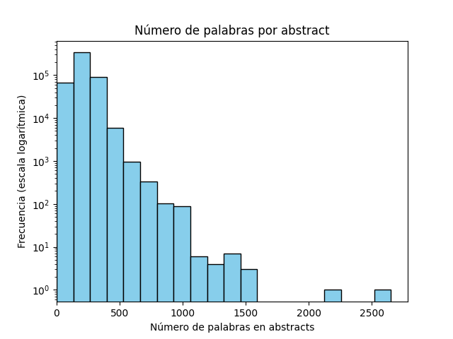

<h1 align="center">MedChat – Medical Domain Chatbot</h1>

### Overview
MedChat is a specialized chatbot designed for the medical domain, capable of answering general health-related questions and assisting with preliminary diagnoses through natural language conversation. The project uses a Retrieval-Augmented Generation (RAG) approach to enhance a base LLM with a vast external corpus of medical literature, aiming to ground the model into this specific domain, reducing hallucinations and improving the factual accuracy of answers. The system retrieves relevant information from a custom medical knowledge base (millions of PubMed abstracts) and provides it as context to the language model, which then generates a tailored response. The entire development and experimentation were carried out using Kaggle Notebooks, which imposed limitations on computational resources and model size, constraining us to use a smaller 7B parameter language model with quantization instead of larger state-of-the-art models.

### Architecture
In the MedChat architecture, user queries are processed through a pipeline that combines information retrieval with generative response generation. The design follows a naive RAG setup consisting of three main stages: Indexing, Retrieval, and Generation. When a user asks a question, the system first converts the query into a vector representation (embedding) and uses this to retrieve the most relevant documents (medical abstracts) from the indexed corpus. The information retrieved is then supplied to the language model alongside the original query, allowing the model to ground its answer in the provided context. Finally, the model generates a response that attempts to address the user's query using the up-to-date medical information from the retrieved documents.

### Dataset
The knowledge base for MedChat is built from a large collection of PubMed article abstracts. We utilized a corpus of approximately 4.6 million medical publication abstracts (title and abstract pairs) as the source of domain knowledge. Due to Kaggle environment constraints, a substantial subset of 500,000 abstracts was sampled and indexed to balance performance and resource limits. Each abstract (with its title as metadata) serves as a separate document in the retrieval corpus. By indexing at the abstract level, we preserve coherent chunks of information that are likely to fully answer specific medical queries.

 *Distribution of abstract lengths (number of words per abstract) on a logarithmic frequency scale.* Most abstracts in the corpus are a few hundred words long (typically 100–300 words), with a long-tail of longer abstracts up to ~2500 words. This distribution informed our decision to use whole abstracts as retrievable units (chunks) — the majority fit comfortably within the context window of our models. In practice, a maximum limit of ~2,500 tokens per chunk was set to ensure that even the longer abstracts could be handled. The extensive PubMed dataset provides broad coverage of medical topics, which is crucial for the chatbot to answer diverse questions.

### Implementation Details
**Embeddings and Vector Store:** To enable semantic search, we used a bilingual sentence embedding model (`jinaai/jina-embeddings-v2-base-es`) to encode both user queries and documents into high-dimensional vectors. This model (137M parameters) supports English and Spanish, allowing MedChat to understand questions in either language and map them to the same vector space as the (primarily English) PubMed abstracts. It also supports long input texts (up to 8192 tokens), which is essential for handling lengthy medical abstracts, so we dont have to worry about chunking. The vector representations of all documents were indexed using FAISS (Facebook AI Similarity Search), an efficient library for large-scale vector similarity search. FAISS enables rapid nearest-neighbor lookup, so given a new query embedding, the system can fetch the top relevant abstracts out of hundreds of thousands in a few milliseconds.

**Language Model:** For generation, we employed the Mistral-7B-Instruct-v0.2 LLM, a 7-billion-parameter transformer model that has been instructed. This model was chosen after trying several open-source models that were restricted from generating medical recommendations. Notably, it offers a large context window (up to 32k tokens) which is key to incorporate retrieved context. We first quantize the model using a 4-bit precision to fit within Kaggle's GPU memory limits, using tools like BitsAndBytes for 4-bit loading. Despite its relatively small size, Mistral-7B was able to leverage the injected knowledge from the retrieval step to generate more accurate and detailed responses.

**Orchestration with LangChain:** The RAG pipeline was implemented with the help of the LangChain framework, which simplifies building conversational AI with memory and retrieval. We set up a ConversationalRetrievalChain that ties together the embedding model, FAISS vector store (as the retriever), and the generative LLM. This chain also maintains a chat memory of the dialogue history, enabling the chatbot to handle multi-turn conversations. When the user asks a follow-up question, the system can generate a standalone reformulated question (considering the conversation history) before performing retrieval – ensuring relevant context is fetched even if the user’s query is implicit or referential. The prompt fed to the language model consists of the user’s (possibly reformulated) question plus the content of the retrieved abstracts, formatted appropriately. The LLM then produces a response in conversational style. We also incorporated prompt engineering techniques (e.g. system instructions) to encourage the model to provide helpful and accurate medical information (and to avoid unsafe or inappropriate content).

**Development Environment:** All experiments (data processing, indexing, model inference, etc.) were executed within Kaggle notebooks. Intermediate artifacts such as the FAISS vector index and prepared datasets (e.g., the filtered PubMed subset and evaluation question sets) were stored in the Kaggle environment. The primary development notebook for this project is available on Kaggle, which includes the code for data ingestion, model setup, chain configuration, and evaluation routines.

### Evaluation
To assess the chatbot’s performance in a medical QA context, we evaluated it on MedMCQA – a large-scale multiple-choice question answering dataset in the medical domain ([MedMCQA: A Large-scale Multi-Subject Multi-Choice Dataset for Medical domain Question Answering](https://proceedings.mlr.press/v174/pal22a.html#:~:text=)). We focused on the validation set (approximately 4,000 questions, reduced to ~2,000 after removing questions with more than one correct answer). Each question comes with four answer options (a, b, c, d), and we tasked the chatbot with selecting the most appropriate option. To make the LLM choose from the given options, we employed a structured prompt with a fixed format: the question and options were presented, followed by an instruction to answer in a JSON format containing just the chosen option (e.g., `{"answer": "b"}`). This ensured the output could be programmatically parsed to evaluate accuracy.

We conducted two evaluation runs: one with the LLM alone (without retrieval) and one with the full RAG setup (LLM with retrieval enabled). The Mistral-7B model by itself achieved an accuracy of ~14.06%, which is worse than doing it at random (25% for four options) . With RAG, using retrieved PubMed abstracts as context, the accuracy increased to ~18.29%. This ~30% relative improvement demonstrates that supplying relevant domain knowledge helps the model make better choices. However, the overall scores were still low, reflecting the difficulty of the MedMCQA task and the limitations of using a not fine-tuned 7B model for such a complex challenge. In many cases, the model did not confidently pick an option (or refused to answer due to uncertainty), which was counted as incorrect . For reference, even the top-performing models in the MedMCQA competition (which are orders of magnitude larger and often fine-tuned on the task) reach only around 55–60% accuracy . Considering that our chatbot was not specifically trained on this dataset (no fine-tuning was done, and no direct exposure to the training set, so zero-shot approach), the RAG-augmented performance, while poor in absolute terms, is a proof of concept that retrieval can inject useful information to improve zero-shot medical question answering.

It’s worth noting that evaluating the chatbot’s performance in free-form conversation is more subjective. There isn’t a single “correct” answer for open-ended user questions, which makes automatic evaluation challenging . As an alternative, we logged example conversations and manually inspected them for coherence and accuracy. These transcripts demonstrated that MedChat can provide relevant information for user queries by leveraging facts from the retrieved literature. They also revealed some failure modes – for example, the bot occasionally mixes up the user’s symptoms with details from retrieved articles – indicating an area for improvement in how the model distinguishes user context from reference context.

### Sample Outputs
During development, a small demo web interface was deployed (via GitHub Pages)  to showcase the chatbot in action and collect example interactions. Users could ask questions through this interface (with the backend running the Kaggle-hosted model), and the conversation transcripts were saved for analysis. 

*(The demo site at **josubarru.github.io** is currently inactive, but the logged conversations from these sessions serve as sample outputs for the project.)* 

### Limitations and Future Work
While MedChat demonstrates the feasibility of a RAG-based medical chatbot on limited hardware, there are several limitations and avenues for future improvement:

- **Model Size & Knowledge:** The current LLM (7B parameters) is relatively small and was chosen due to Kaggle’s constraints. A larger model (or an ensemble of models) fine-tuned on medical data could potentially yield more accurate and nuanced answers. Fine-tuning the existing model on domain-specific Q&A or dialogue data (if resources allow) would likely improve its reliability.
- **Language Output:** At present, MedChat often responds in English even if the question is asked in Spanish. This is primarily because the retrieved knowledge (PubMed abstracts) is predominantly in English, and the model was not specifically instructed or adjusted to output answers in Spanish. Extending the system to fully support bilingual conversations would require translating the retrieved context or the model’s outputs. One approach could be to integrate a translation layer or to include Spanish-language medical sources in the knowledge base.
- **Context Integration:** The chatbot sometimes struggles to distinguish between information provided by the user and information from retrieved documents, which can lead to confusion (for example, assuming a symptom mentioned in a retrieved article applies to the user). Future iterations could refine the prompt format or retrieval filtering to ensure the model clearly identifies what details come from the user vs. from the knowledge base. Techniques like highlighted context or prompt annotations could help the model differentiate sources of information during generation.
- **Retrieval Enhancements:** We currently use a basic single-step retrieval strategy. More advanced RAG techniques (such as iterative retrieval, result re-ranking, or a multi-vector RAG approach) could be explored to fetch more relevant information for complex queries. Additionally, increasing the size and scope of the knowledge corpus (closer to the full 4.6M abstracts, or adding other medical databases) may improve coverage, albeit with a trade-off in retrieval time and index size.
- **Evaluation & Safety:** A more comprehensive evaluation of the chatbot’s performance in real interactive settings is needed. This could involve user studies or feedback from medical professionals to assess the helpfulness, accuracy, and safety of the responses. Ensuring medical safety is paramount: the bot should ideally recognize when a query requires professional medical advice and prompt the user to consult a doctor, rather than giving speculative answers. Future work might incorporate medical dialogue datasets to fine-tune the bot’s responses (making it more cautious and aligned with medical best practices).

By addressing these areas, MedChat can evolve into a more robust and practical tool for medical information assistance. The combination of an enriched knowledge base and a more powerful language model would significantly enhance its ability to handle specialized queries and converse naturally in both English and Spanish.

### Links
- **Kaggle Notebook:** [MedChat Development Notebook](https://www.kaggle.com/code/josubarru/medchat/notebook) – The primary Kaggle Notebook where MedChat was implemented (note: there are multiple versions in Kaggle; this link points to the latest saved version).
- **Demo Website:** [MedChat Demo (GitHub Pages)](https://josubarru.github.io/) – A GitHub Pages site that hosted the chatbot for demonstration purposes (currently inactive, but it stored example interactions for review).
- **Hugging Face – Embeddings Model:** [jinaai/jina-embeddings-v2-base-es](https://huggingface.co/jinaai/jina-embeddings-v2-base-es) – Bilingual Spanish-English embeddings model used for vector representations.
- **Hugging Face – Language Model:** [mistralai/Mistral-7B-Instruct-v0.2](https://huggingface.co/mistralai/Mistral-7B-Instruct-v0.2) – The pre-trained 7B language model used (quantized for this project).
- **LangChain Framework:** [LangChain Documentation](https://python.langchain.com/) – Framework used to integrate the retrieval and generation components with conversational memory.
- **MedMCQA Dataset:** [MedMCQA Dataset](https://proceedings.mlr.press/v174/pal22a.html#:~:text=) – The large-scale medical multiple-choice question answering dataset used for evaluation.